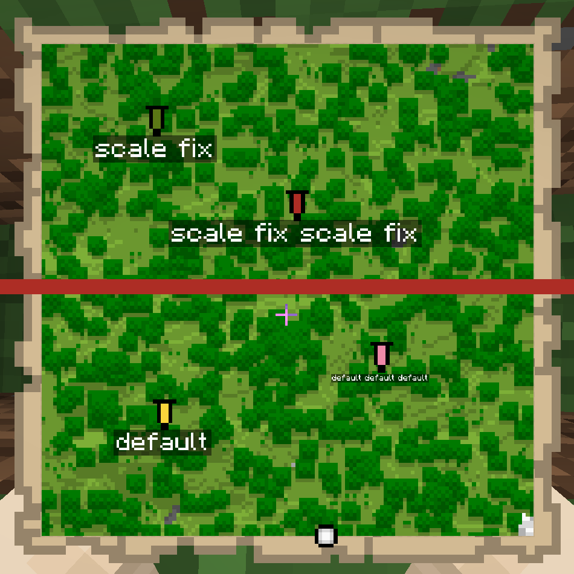

## About
Simple mod that allows you to set the scale of the map waypoint text. Makes all waypoints the same size

## Configuration
It's best to use the [Mod Menu](https://modrinth.com/mod/modmenu) to access the configs, but you can manually modify the **mapwaypointtextscale.json5** file in the config folder of your Minecraft directory

## Dependencies
- [owo-lib](https://modrinth.com/mod/owo-lib)
- [fabric-api](https://modrinth.com/mod/fabric-api)